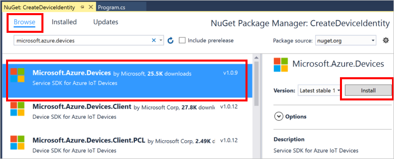

# How to install a NuGet Package via the Visual Studio Interface

This document explains how to install *NuGet Packages* via the Visual Studio interface.

NugGet Packages are libaries of code written by various authors including Microsoft which have been made available at the [http://nuget.org](http://nuget.org) website. These can be easily downloaded and referenced from your own projects.

To add a NuGet Package to your project, follow these steps.

1. With Visual Studio open, then from Solution Explorer, __Right-click__ on your __project's name__, and then __Click Manage Nuget Packages__.
2. In the __Nuget Package Manager__ window, select __Browse__.
3. Enter the full or partial name of the package you need, e.g. Mlicrosoft.Azure.Devices
4. Select __Install__ then accept the terms of use.

This procedure downloads and installs the package then adds a reference to your project. Any dependencies will be downloaded and installed at the same time.

