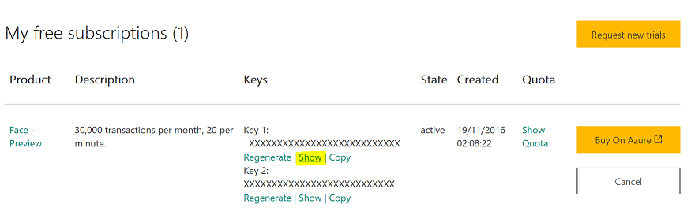
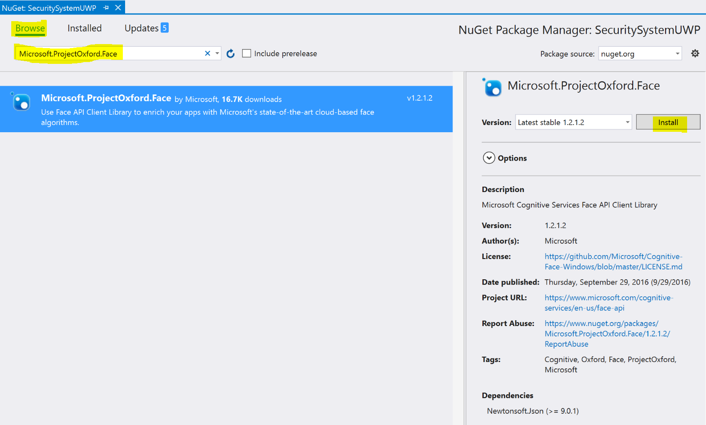

# Fraud Detection Scenario

Scenario
========

For this scenario you will imagine that you are building a system that authenticates users by use of a photo scan of their face.
You will attach a regular USB camera to your Windows IoT Core device and once a photo has been taken, the image will be sent to Cortana Analytics which will use __Face Verification__ which is part of the [Face API](https://www.microsoft.com/cognitive-services/en-us/face-api/documentation/overview) to analyse the photo and determine if this person should be allowed access.

You will use a motion sensor attached to the device which will be used to trigger the taking of a photograph when there is movement near the camera.

The Face Verification API works by analysing several pictures, the first are several "known" images of the person, the second is the image being tested, i.e. the photo which has just been taken.
If a face is detected in the photo and a possible match has been found, Cortana will return a number between 0 and 1 informing you of how confident it is.
For the purposes of this excercise you will consider results of 0.75 or more to be a successful match.

The scenario sample application comes preloaded with known images for three different people bug you can add your own if you want.
For testing purposes, it has to ability to simulate a camera that takes a photo of one of the known people.

Basic Hardware Setup
====================

__TODO - This section needs reviewing and updating__

1. Set up your PC and RPi according to these [instructions](http://ms-iot.github.io/content/en-US/win10/SetupPCRPI.htm). Make a note of the IP address of the device, you'll need it for later.
2. Wire the PIR sensor as shown in the image below being sure to use 10 kΩ pull-up resistor.

Azure Pre-reqs
==============

1. Create a new Azure Storge account via the https://portal.azure.com portal.
2. Open the settings for the new storage account and make a note of it's name and access key.
3. Create a new container in the Storage Account called *secuirtysystem-cameradrop*. This is where images will be uploaded to for processing. 
4. Open a new broswer and navigate to the Cognitive Services Subscriptions page [https://www.microsoft.com/cognitive-services/en-US/subscriptions](https://www.microsoft.com/cognitive-services/en-US/subscriptions). You'll have to sign-in using your Microsoft Account.
5. At the prompt to trust the website, say *Yes*.
6. You'll now need to verify your email address, press the "Send verification" link on the right hand side of the screen.
7. 
8. Check your email and click on the link to verify your email address.
9. Return to the [https://www.microsoft.com/cognitive-services/en-US/subscriptions](https://www.microsoft.com/cognitive-services/en-US/subscriptions) page, check the __Face - *Preview*__ option and press __Subscribe__ at the bottom of the page. This will generate two *Access Keys* (just think passwords) for accessing the Face API.
10. Click on the *Show* link to display your access key. Make a copy of this as you'll need this for later in the scenario.
11. .

Software Setup
===============

__The following steps should be carried out on your development machine__ which has Visual Studio 2015 installed:

1. Create a new folder called `c:\source` to store the content you are about download.
2. Open the Command Prompt to navigate to the new folder.
3. Run the git clone command: `git clone https://github.com/UKNorthernlad/AzureFastStartForIoT.git` to download a copy of the class content. This contains a basic UWP application which takes photos and uploads them to Azure Blob Storage.
4. Open the project root folder in Explorer: `c:\source\AzureFastStartForIoT\Fraud Detection\CameraSystem\SecuritySystemUWP`.
5. Open the SecuritySystemUWP.sln solution file, in the SecuritySystemUWP folder, using Visual Studio 2015.
6. From the tool bar, choose "Remote Machine" as the target to deploy your application to.
7. 
8. From the pop-up dialog, you should see the name and IP of your device has been autodetected (*minwinpc -- 192.168.1.5* in this case), __click 'select'__  to set it as the target for deployment device. *If your device is not shown, you can manually enter the IP address being sure to use the default authentication mode (i.e. Universal - unencrypted).*
9.  
10. Configure Visual Studio to compile the application for the ARM platform (which a requirement to run on the RPi). __Right-click__ on the name of your solution in Solution Explorer and choose *"Configuration Manager".* 
11. Set the *Active solution platform* setting to __ARM__. Click __Close__.
12. Right-click on the __com.microsoft.maker.SecuritySystem__ project and select "Build". This will download nuget packages and compile this project.
13. Repeat the process for the __OneDriveConnector__, __PirSensor__ and __UsbCamera__ projects. 
14. Finally repeat for the __SecuritySystemUWP__ project. *All projects should have built with out errors (some warnings about async methods might be seen - these can be ignored).*
15. You can now deploy and test the application by pressing `F5`. *The first time you deploy an application it make take some time as required framework updates are installed onto the device - Visual Studio may even display some "This is taking too long messages" - Be patient! Subsequent deployments will be much quicker.*

Configuring and Testing the App - Part 1
========================================

1. Use your web browser to navigate to http://*yourdeviceipaddress*:8000. You will see a landing page for your application running on your device.
2. Click on the "Settings" link from the left hand navigation menu.
3. Ensure that the camera type setting configured as "Simulated" and press "Save" at the bottom of the screen.
4. Moving your hand in front of the motion sensor will cause the "Simulated" camera to take a photo. *If you don't have the sensor setup, you can take a photo manually as described in the selction below.*
5. An image called *Ident1.jpg* has been created in the *Pictures*\_securitysystem-cameradrop_ folder on the device. You can view this file via http://*yourdeviceipaddress*:8000/gallery.htm or by browsing to \\*yourdeviceipaddress*\c$\Data\Users\DefaultAccount\Pictures\securitysystem-cameradrop\. *You will need to enter the Admin username and password to access the fileshare*.
6. Attach a USB webcam to the RPi and wait a few seconds whilst Windows loads the drivers. *At the time of writing, the offical RaspberryPi camera is not supported on Windows 10 IoT Core :(*
7. Repeat steps 2,3 and 4 this time setting "Usb" as the camera type.
8. Trigger the taking of a new photo by moving your hand in front of the motion sensor. You should now see a real photograph of yourself in the gallery/cameradrop folder.

Manually Taking a Photograph
============================

You can manually trigger the taking of a photo rather than relying on the motion sensor by:-

1. Clicking on the "Action" link on the nav menu
2. Clicking "Take Photo". *This will take a photo using either the simulated or attached USB camera.*

Adding Cortana Analytics Face API support
=========================================

In this section you are going to enable the photo you've just taken to be sent to Cortana Analytics to see if it recognises you. The process of sending your photos to Cortana is easy when you use the Face SDK as these pre-written libaries do all the heavy lifting for you.

Face API can be used to identify a person based on a photograph and a people database (called a __Person Group__ in the SDK) which needs to be created in advance and can be edited over time.
The following figure is an example of a person group named "myfriends". Each group may contain up to 1,000 people and each person can have one or more photos registered. 

.

Read more about how Face Verification works in the [Face API Documentation](https://www.microsoft.com/cognitive-services/en-us/face-api/documentation/overview).

You are now going to add new code to the camera project to support the Face API.

1. If the UWP application is still running in the debugger from the previous section, stop debugging now.
2. Right-click on the __SecuritySystemUWP__ *project* in Solution Explorer and click __Manage NuGet Packages...__.
3. In the NuGet dialog, press *Browse* then enter *Microsoft.ProjectOxford.Face* into the search box. Select the (probably) only result from the list then press "Install". It might be that this package is already installed, in which case you will see a small green circle containing a white check mark next to the name of the packag.
4. 
5. Open the *Controller.cs* file and around line 95 locate and uncomment the following code: *FaceClient = new FaceClient(XmlSettings.FaceAPIKey);*. This is the core client object that knows how to connect to Face API. Notice it takes a *key* as a parameter, this value which will be read from the settings configuration file is your "password" for accessing the Face API service.
5. Open the FaceAPI/FaceAPI.cs file and locate the __RegisterKnownUsersAsync()__ method.
6. Uncomment all the code in the __Create new Person Group__ region. This section uses the FaceClient object to create a new PersonGroup called "AuthorisedUsers".
7. Uncomment all the code in the __Upload images for each person__ region. This wil upload "known" images for several people from a folder called *Pictures/Camera Roll/knownimages*.
8. Uncomment all the code in the __Train the Model__ region. This tells the machine learning algorithm to analyze the known photos and build a working model. *Each time you add a new photo of an existing person or add an entire new person the model will need to be retrained.*
9. Round about line 107 uncomment the line *App.Controller.Camera.PhotoTaken += Camera_PhotoTaken;*. Now, eachtime a new photo is taken it will be sent to Cortana for analysis.
10. Finally, on or about line 392 of WebServer/WebServer.cs uncomment the line *await App.Controller.FaceClient.RegisterKnownUsersAsync();* and also the following *result = .... ; * line. These lines which are part of a button pressed event handler will trigger the uploading of the known images and training of the machine learning Face API model.

Configuring the App for the Face API access
===========================================

1. Use your web browser to navigate to http://*yourdeviceipaddress*:8000. You will see a landing page for your application running on your device.
2. Click on the "Settings" link from the left hand navigation menu.
3. Enter the FaceAPI key your created at the beginning of the scenario into the FaceAPI settings box. __The web server built into the UWP app does not support secured connections so all information is received & sent in the clear - beware!__
4. Press *Save* at the bottom of the page.

Configuring and Testing the App - Part 2
========================================

1. Take 5 or 6 good selfies with your mobile phone. *Where possible make sure you are looking more or less straight at the camera and there is nothing in the background of the image. Ideally you could ask another person to take the photo of you stood against a wall with a plain background. Ensure also the lighting in the room is good or if possible take the photos outside on bright sunny day. A good, clear and well light photograph will vastly increase the chances of a positive match.*
2. From Explorer, copy all the photos to the device by pasting them into the folder `\\*yourdeviceipaddress*\c$\Data\Users\DefaultAccount\Pictures\Camera Roll\knownimages\<yournamehere>`.
3. You now need to upload the "known" photos to Cortana for processing. Navigate to http://*yourdeviceipaddress*:8000 and from the "Actions" menu on the Navbar, click "Send Known Images for Face API Training". Wait for the green "Uploading Complete" message to appear at the top of the Actions page before continuing.
4. Now, moving your hand in front of the motion sensor or manually triggering a photo will trigger the taking of a photo.
5. The photo will then be sent to Cortana for analysis and if the user is recognised, an entry will be placed into a log file in the "knownimages" folder where you placed your selfies earlier.

Keeping an archive of photos
============================

You may want to keep an archive of photos taken by your device but storing these long term on the device is not an option. Here you will configure the scenario to upload the photo into an archive in Azure blob storage.

1. Navigate to the Settings page on your device. http://*yourdeviceipaddress*:8000.
2. Change the Storage type to *Azure* and enter the storage account name and key you saved from earlier. Other settings can be left either blank or at their defaults. __The web server built into the UWP app does not support secured connections so all information is received & sent in the clear - beware!__
3. Press *Save* at the bottom of the page.
4. 
5. Trigger the taking of a photograph as done is previous sections. Every 60 seconds the photos in the "securitysystem-cameradrop" folder will be uploaded to Azure Storage account your configured in the "Azure Pre-reqs" section above.