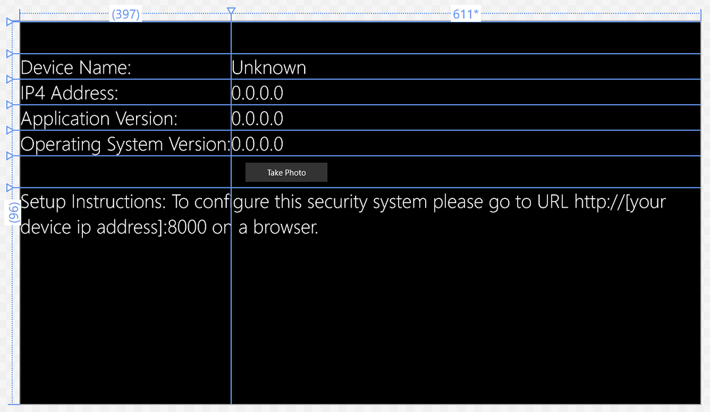

# Fraud Detection Scenario

Scenario
========

For this project you will attach a regular USB camera to your Windows IoT Core device along with a PIR sensor (the required hardware will have been supplied to you by your instructor).
This basic system will detect movement near the camera and trigger it to take a photograph. The image will be uploaded to Azure where Cortana Analytics will analyse the photo.
 __TODO: What will it do with it?__

Basic Hardware Setup
====================

1. Set up your PC and RPi according to these [instructions](http://ms-iot.github.io/content/en-US/win10/SetupPCRPI.htm).
2.  Wire the PIR sensor as shown in the image below being sure to use 10 kΩ pull-up resistor.

Azure Pre-reqs
==============

1. Create a new Azure Storge account via the https://portal.azure.com portal.
2. Open the settings for the new storage account and make a note of it's name and access key.
3. Create a new container called *secuirtysystem-cameradrop*. This is where images will be uploaded to for processing. 

Software Setup
===============

1.  Create a new folder to store the sample projects you'll soon download. Call this something short, e.g. c:\iotproject
2.  Use the Command Prompt to navigate to the new folder where you want the project: `cd c:\iotproject` 
3.  Run the git clone command: `git clone https://github.com/ms-iot/securitysystem.git` to download a copy of the basic UWP application which takes photos and uploads them to Azure Blob Storage.
4.  Change directory to the project root folder: `cd securitysystem`
5.  Next, get the submodules for the USB camera and the PIR sensor by running the following commands: `git submodule init` followed by `git submodule update`
6.  Open the SecuritySystemUWP.sln solution file, in the SecuritySystemUWP folder, using Visual Studio 2015.
7.  Right-click on the __com.microsoft.maker.SecuritySystem__ project and select "Build". This will download nuget packages and compile this project.
8.  Repeat the process for the __OneDriveConnector__, __PirSensor__ and __UsbCamera__ projects. 
9. Finally repeat for the __SecuritySystemUWP__ project.
10.  All projects should have build with out errors (some warnings about async methods might be seen - these can be ignored).

11.  From the Solution Explorer, right-click on the Solution name (SecuritySystemUWP) and choose *Configuration Manager*.

__TODO: Create screen shot for building against ARM __

12. From the top menu of Visual Studio, select Debug and ARM (if you are using a Raspberry Pi).
13. Next click Build -> Clean Solution. Wait for the solution to clean successfully. 
14. Select Remote Machine. You will have to enter your Remote Machine IP address and use "Universal (Unencrypted Protocol)" for Authentication Mode. *Use WindowsIoTCoreWatcher to find your IP address*.
15. You can now deploy and test the application by pressing `F5`.

Configuring the Web App
=======================

1. Use your web browser to navigate to http://yourdeviceipaddress:8000. You will see a landing page for your application running on your device.
2. Click on the "Settings" link fron the left hand navigation menu.
3.  Change the Storage type to *Azure* and enter the storage account name and key you saved from earlier. Other settings can be left either blank or at their defaults.
4. Press *Save* at the bottom of the page.

Testing the application
=======================

1.  Moving your hand in front of the PiR sensor will trigger the USB camera to take a photograph.
2. The image is storaged in a folder in the Photos folders on the device. You can view it at http://yourdeviceipaddress:8000/gallery.htm
3.  Every 60 seconds, these images are uploaded to the Azure blob container you created earlier. The originals on the device are deleted.

Manually taking a photograph
============================

If you don't want to or can't setup the PiR detector, you can make a small change to the application to trigger a photo manually.

For devices with an attached monitor you can add a button to the UWPs main application:

1. Open the MainPage.xaml and add a button to the canvas wherever you want.
2. Set it's content to "Take Photo".

3. Double click the button to add and event handler, then add the following code

            ICamera cam = App.Controller.Camera;
            await cam.TriggerCapture();

4. Rebuild and redeploy your application to your device. You might need to configure the application again with storage type, name and key.

If your device does not have an attached screen, you will have to add a button to the homepage of the apps built-in webserver:

__TODO__ : Add method for creating button on the home htm page.