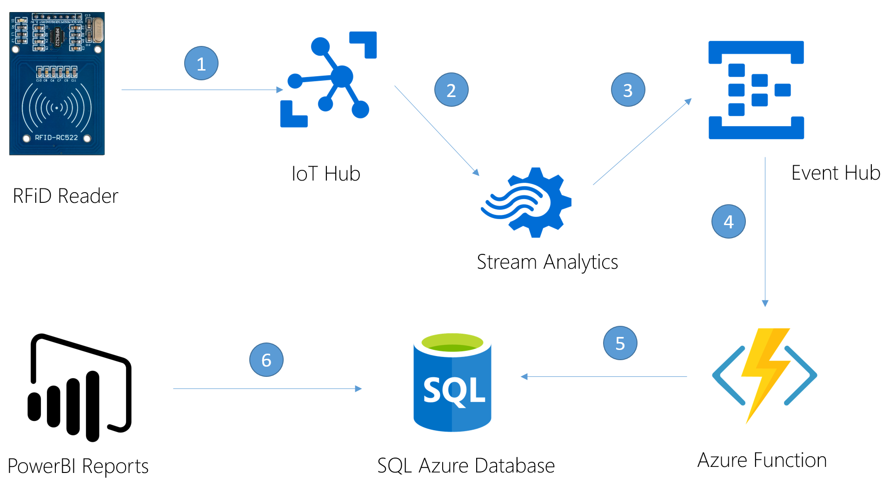
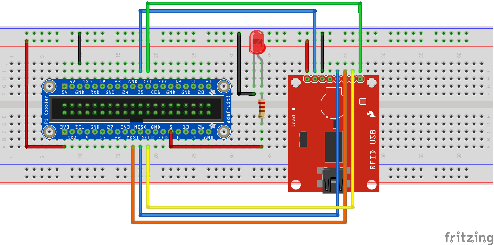
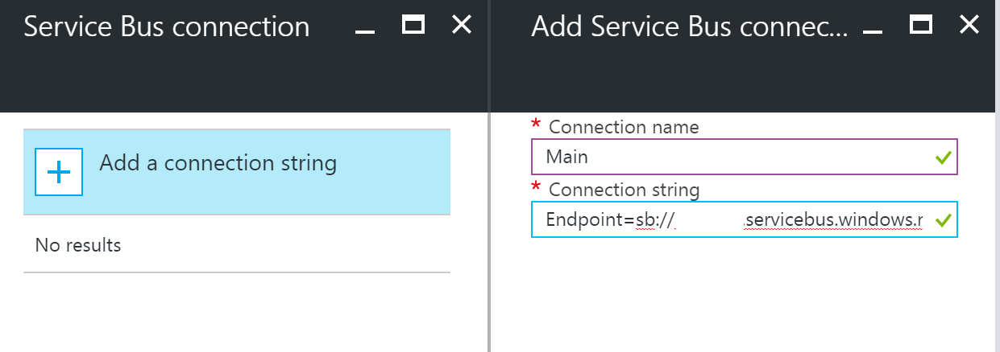

# Management System and Inventory


Scenario
========

In this scenario you will imagine that you are building a system to support a stocking taking programme in a warehouse.
Employees will scan the tags of stock items before storing them in known locations.
This information will be uploaded to IoT Hub and stored in a database for reporting purposes.

Credit for this project is as follows:-

* [Microsoft Premier Services](https://www.microsoft.com/en-us/microsoftservices/support.aspx).

Architecture
============



1. An RFiD Reader will scan a tagged item then send the details to an IoT Hub. Each reader will be registered as a unique device.
2. A Stream Analytics job collects the scanned data and moves it to an Event Hub. Currently nothing is done to process the data but in a later update to this scenario Stream Analytics will be used to detect duplicate tags across multiple store locations.
3. The data is uploaded to a regular Event Hub where it is queued for processing.
4. An Azure Function is configured to trigger off the arrival of a message at the Event Hub.
5. The details of the scanned item will be inserted/updated in an Azure hosted SQL Database.
6. PowerBI will be used to build a quick and simple report to display the stock inventory details from the backend database.

Basic Hardware Setup
====================

As described in the [Kit List for these scenarios](/Electronics/Kit%20List.md), you will need the following hardware items to build this scenario:

* [Microsoft IoT Pack for Raspberry Pi 3 - w/ Raspberry Pi 3](https://www.adafruit.com/products/2733)
* [1 x USB cable - A/MicroB - 3ft](https://www.adafruit.com/product/592)
* [1 x Adafruit Assembled Pi Cobbler Breakout + Cable for Raspberry Pi - Model B](https://www.adafruit.com/product/914)
* RFID-522 Breakout board.
* An LED.
* 220 Ohm Resistor.
* Jumper wires.

## Basic Circuit



The RFID-522 breakout board is capable of connecting to a controlling device via Serial UART, I2C or SPI. For this scenario, we'll use Serial Peripheral Interface (SPI).

| RPi Pin | RFID-522 Pin | Usage                   | Colour |
| ------- | ------------ | ----------------------- | ------ |
| 3V3     |Vcc           | 3.3v                    | Red    |
| GND     |GND           | Ground                  | Black  |
| G5      |RST           | Device Reset            | Blue   |
| CEO     |SS            | Slave Select            | Green  |
| MOSI    |MOSI          | Master Out - Slave In   | Orange |
| MISO    |MISO          | Master In - Slabout Out | Blue   |
| SCLK    |SCK           | Clock timing pulse      | Yellow |


For interest/reference, these are the PINs on the Raspberry Pi.


Azure Pre-reqs
==============

1. A working Azure subscription or trial - http://portal.azure.com
2. A working PowerBI subscription or trial - http://www.powerbi.com
3. The PowerBI Desktop tool must be downloaded from https://powerbi.microsoft.com/en-us/desktop/ and installed on your development machine.

Develoment Machine and IoT device Setup
========================================

1. Ensure your local development machine is setup according to these instructions: [Azure IoT Development machine setup](../IoT Developer Setup.docx?raw=true).
2. Part of the above document describes installing the "Device Explorer" tool - make sure that you *do* follow these instructions as you'll need that tool later on.
3. Ensure you have installed the [Connected Service for Azure IoT Hub Visual Studio Extension](https://marketplace.visualstudio.com/items?itemName=MicrosoftIoT.ConnectedServiceforAzureIoTHub)
4. Ensure you have [followed the instructions](https://developer.microsoft.com/en-us/windows/iot/docs/iotdashboard) to __Use the Windows 10 IoT Core Dashboard__ to setup your Raspberry Pi.

*Note about setting up Wi-Fi on the RPi:* IoT Dashboard shows all available networks that your PC has previously connected to. If you don’t see your desired Wi-Fi network on the list, ensure you’re connected to it on your PC. If you uncheck the Wi-Fi box when writing the Windows 10 IoT Core image onto your SD card, you must connect an Ethernet cable to your board after flashing. Whether using Wi-Fi or Ethernet, your device will recieve an IP via DHCP at start up.

For more in depth guidance on setting up your hardware device see [Get Started](https://developer.microsoft.com/en-us/windows/iot/GetStarted).

Step 1 - Build an IoT Hub
=========================


You are going to start by building an IoT Hub that hand RFiD scanners carried by employees will upload their data to.

1. [Open the Azure Portal](https://portal.azure.com).
2. Click (+)-->Internet of Things-->IoT Hub.
3. 
4. Enter a unique name for the IoT Hub, choose a Pricing and Scale tier (note that Free has been choosen here), select or create a Resource Group and datacentre location and __Click Create__.
5. 
6. Once the IoTHub has been created, ensure you make a copy of the *iothubowner* Connection String - this is shown via the *Shared Access Policies-->iothubowner* blade.
7.   
8. Also make a copy of the *Event Hub-compatible name* & *Event Hub-compatible endpoint* values - these appear on the *Messaging->EndPoints->Events->Properties* blade. You'll need these later on when you start to read data back from IoT Hub.
9. 
10. Finally on the same *Properties* blade, create a new Consumer Group called __dbstore__, then press __Save__. Consumer groups allow multiple applications to each receive their own copy of the messages sent to the IoTHub.
11. 

Step 2 - Register your device with IoT Hub
==========================================

For your device to connect to IoT Hub it must have its own Device Identity (aka set of credentials).
The process of obtaining these is known as *Registering your Device*.
Currently there is no way to do this via the Azure Portal but there is a remote API available.
Rather than write a custom application to connect & register a new device, you are going to use Device Explorer, a tool which is part of the IoT SDK.

1. Open the Device Explorer (*C:\Program Files (x86)\Microsoft\DeviceExplorer\DeviceExplorer.exe*) and fill the IoT Hub Connection String field with the connection string you created in previous step and click on __Update__. *If you don't have this tool installed, see the section at the top of this page about how to install it*.
2. 
3. Go to the __Management tab__ and __Click on the Create button__. The Create Device popup will be displayed. Enter "__device1__" as the Device ID for your device  and __click on Create__. *The device name is important as other parts of the supplied sample program rely on this*.
4. 
5. Once the device identity is created, it will be displayed in the grid. __Right click__ on the device entry you just created and select __Copy connection string for the selected device__. Paste this into a notepad as it will be required later on.
6. 

__Note__: The device identities registration can be automated using the Azure IoT Hubs SDK. An example can be found at https://azure.microsoft.com/en-us/documentation/articles/iot-hub-csharp-csharp-getstarted/#create-a-device-identity. 

Step 3 - Create an Event Hub
============================


The Event Hub will act as an intermediary for scanned and uploaded data before it gets processed by the Azure Function.

1. Click (+)-->Internet of Things-->Event Hub.
2. Enter a unique name for the Service Hub namespace, choose a Pricing tier, select or create a Resource Group and datacentre location and __Click Create__.
3. 
4. Once the Event Hub has been created, from it's settings blade click on __+New Event Hub__, enter a unique name for the Event Hub and __Click Create__.
5. 
6. Once the Event Hub has been created, ensure you make a copy of the *RootManageSharedAccessKey* Connection String Primary Key- this is shown via the *Shared Access Policies-->RootManageSharedAccessKey* blade.
7. 

Step 4 - Stream Analytics Job
=============================


The role of Stream Analytics is simple: to copy messages unchanged from the IoT Hub to the Event Hub.
In a later update to this scenario, this will be modified to detect duplicate RFiD tags being used in multiple locations.

1. Click (+)-->Internet of Things-->Stream Analytics Job.
2. Call the job "ProcessRFID", select a Resource Group and click __Create__.
3. Once the Stream Analytics Job has been created, click on it's homepage, then click __Inputs__, then click __Add__.
4. 
5. Enter the values shown below to define where Stream Analytics will obtain its Input data from. *You will select the name of the IoT Hub you created in a previous step*. Click __Create__ when you are done.
6. 
7. Back on the Stream Analytics job homepage, click __Outputs__ then __Add__ to define an output location for the job.
8. Enter the values shown below to define where Stream Analytics will send its Output data to. *You will select the name of the Service Bus Namespace and Event Hub you created in a previous step*. Note that *Partition Key Column* is left blank. Click __Create__ when you are done.
9. 
10. To ensure messages from passed from the IoT Hub to the Event Hub, you will need to define a query. From the job's homepage, click __Query__ which is sandwiched between Inputs and Outputs which you clicked earlier.
11. Enter the following query:-
        ```
        SELECT
         *
        INTO
            [EHOut]
        FROM
            [IoTHub]
        ```
13. 
14. Back on the Stream Analytics Jobs's homepage, click __Start__ at the top of the blade. This will ensure messages are copied from input to output.


Step 5 - Create an Azure Database
=================================


The details on how to create a new Azure SQL Database are very well documented and won't be copied here, instead you should browse to:

`https://docs.microsoft.com/en-us/azure/sql-database/sql-database-get-started`

and follow the instructions under the section __Create a new logical SQL server in the Azure portal__.
You can call the logical database server whatever you want, just keep a record of the name and credentials your create for later.
You don't need to create a new database as this will be done for you later by the Entity Framework (just remember to keep a record of the username and password for the server).

Once your logical server has been created, you can build a connection string like this (replacing the server name, username and password placeholders with your own details).

`Server=tcp:YOUR_SERVER_NAME_HERE.database.windows.net,1433;Database=RFIDStock;User ID=YOUR_LOGIN_NAME_HERE;Password=YOUR_PASSWORD_HERE;Encrypt=True;TrustServerCertificate=False;Connection Timeout=30`

Note as part of the above connection string there is a `Database=RFIDStock` key/value pair. This information will be used later by the Entity Framework to create a new database with this name on your new logical server.

Make a note of this completed connection string as you'll need it soon.

> You will also need to create a firewall rule to allow the PowerBI components access to the database. Follow the details under the __Create a server-level firewall rule in the Azure portal__ section on the the above page for details on how to do this.

Step 6 - Setup an Azure Function to process incoming data
=========================================================


Azure functions are background jobs written in C# or Node.js that run on web servers and process data.
You are going to use one to read the data which has been sent to the Event Hub from Stream Analytics then insert it into the database.
To make this easier you'll use the Entity Framework with a *code first* model to automatically create the database with the correct schema on the logical SQL Server you created previously.

1. Open a new browser tab at the http://functions.azure.com page. *This will allow you to create a new Function App and a container website for your data processing functions.*
2. Enter a suitable *name* for the Function App Website , *a region*, then click *"Create"*.
    
3. From the Function App homepage, press +New Function in the upper left hand side of the screen.
    .
4. Select the __EventHubTrigger-CSharp__ function template.
    
5. Enter the details to setup and configure the function. *Ensure you name the function* __RFiDFunc__ *as shown and enter the name of the Event Hub you created earlier from which you want to pull messages. In order for this function to read those messages, it will need a connection string. Click on the __New__ link to the right of the "Event Hub Connection" box, click __Add a Connection String__ and enter the details the Event Hub Connection string you saved from earlier, remember that it looks something like this* `Endpoint=sb://somenamehere.servicebus.windows.net/;SharedAccessKeyName=RootManageSharedAccessKey;SharedAccessKey=BjTiZe6GUhH1PjG6AQKt1nROm2YwVWU3L4wMFpY7JiM=`
     

> You now have a basic Azure Function that will trigger each time a new message arrives at the Event Hub. Let's now update this to send the output to the Azure SQL Database.

7. From the Azure Function Code Editor screen, press __View Files__ in the upper right-hand corner of the screen, press __+ Add__, then add a new file called *project.json*.
     
8. Enter the following text into the file (to ensure that the Entity Framework is loaded before the Function trys to run), then press the red *Save* button at the top of the page: 
```  
    {
      "frameworks": {
        "net46":{
          "dependencies": {
            "EntityFramework": "6.1.3"
          }
        }
       }
    }
```    
9. Back in the project files explorer, click *run.csx* then enter the following code into the main editor (followed by *Save*):
```
#r "Newtonsoft.Json"

using System;
using System.Data.Entity;
using System.Data.Entity.Infrastructure;
using System.Data.Entity.Core.Objects;
using System.Linq;
using System.ComponentModel.DataAnnotations;
using System.Data.Entity.SqlServer;
using System.Net;
using Newtonsoft.Json;


public static void Run(string myEventHubMessage, TraceWriter log)
{
    log.Info($"New message detected, starting new run.....");

    // Raw input data for debugging purposes.
    log.Info($"Raw Data: {myEventHubMessage}");
    dynamic data = JsonConvert.DeserializeObject(myEventHubMessage);
    log.Info($"DeviceId: {data.deviceId}");
    log.Info($"Time: {data.Time}");
    log.Info($"Location: {data.Location}");
    log.Info($"RFiD: {data.RFiD}");

    // Create a new item for insertion into the SQL Database.
    StockItem item = new StockItem();
    item.DeviceId = data.deviceId;
    item.Time = data.Time;
    item.Location = data.Location;
    item.RFiD = data.RFiD;

    // Use Entity Framework to write the data to the SQL Database.
    Model1 db = new Model1();
    db.StockItems.Add(item);
    db.SaveChanges();
}

// The required Entity Framework custom Context class.
public class Model1 : DbContext
{
    public Model1(): base("name=Model1")
    {
    }

    // A new table for storing stock items.
    public virtual DbSet<StockItem> StockItems
    {   
        get;
        set;
    }
}

// Our POCO class to define the data we wish to store in the SQL Database.
public class StockItem
{
    [Key]
    public int Id { get; set; }
    public string DeviceId { get; set; }
    public DateTime Time { get; set; }
    public string Location { get; set; }
    public string RFiD { get; set; }
}


// This custom database configuration class is required to indicated to Entity Framework the database provider we wish to use.
// Normally this is set in an EnityFramework section of the web or app.config but Azure Functions don't use those!
public class MyDBConfiguration: DbConfiguration
{
    public MyDBConfiguration()
    {
        SetProviderServices("System.Data.SqlClient", SqlProviderServices.Instance);
        SetDefaultConnectionFactory(new SqlConnectionFactory());
    }
}
```
15. Click the *Function App Settings* link in the lower left hand menu followed by the *Configure App Settings* link under the *Develop* heading.
16. On the Application Settings blade, scroll to the bottom of the page to the *Connection Strings* section.
17. Enter a new connection string called `Model1`, a type of `SQL Database` and for the value enter the connection string to your Azure SQL Database. *Remember your SQL Database connection string will look something like this:*: `Server=tcp:somedbname.database.windows.net,1433;Database=RFIDStock;User ID=someusername;Password=somepassword;Encrypt=True;TrustServerCertificate=False;Connection Timeout=300`. *Remember to include the space between "User Id" - this might not be obvious with the formatting of the text on the page*.
19. Press *Save*.

The Azure Function is now complete. It will automatically run when new messages arrive at the Event Hub. 


Step 7 - Build an application to upload scanned RFiD tags
=========================================================


In this section you will configure a precreated UWP application for IoT Core which acts as an RFiD scanner that an operative in a warehouse might carry.

1. Open the *\source\RFiDReader\RFiDReader.sln* solution in a new copy of Visual Studio.
2. Open the *AzureIoTHub.cs* file and update the __deviceConnectionString__ connection string to reflect the device connection key you copied when registering a device using the *Device Explorer* tool. Remember  that is look something like this: `HostName=devhubby99.azure-devices.net;DeviceId=device1;SharedAccessKey=LALEdC+ihi2ToNf9iNQlQWUcLARsE2RP0ECjUMRrHdI`
3. Press `F5` to launch the tool. It will take a minute or two to deploy for the first time. Once the application is running, you should see the "Running..." appear in the Output window of Visual Stutio and the LED should illuminate.
4. Touch an RFiD card against the reader. The LED will go off to indicate the card is being read and the data uploaded to Azure IoT Hub. The packet of data looks like this:
```
{"deviceId":"device1","Time":"2017-01-17T13:36:09.4381693Z","RFiD":"d53a92c4","Location":"StoreLocation123"}
```

5. Once the upload has completed, the LED will illuminate again.

Step 8 - View the captured data
================================

In order to view the captured data, use the Database connection tools in Visual Studio or the full SQL Management Studio to connect to your database and view the data in the *StockItems* table.


