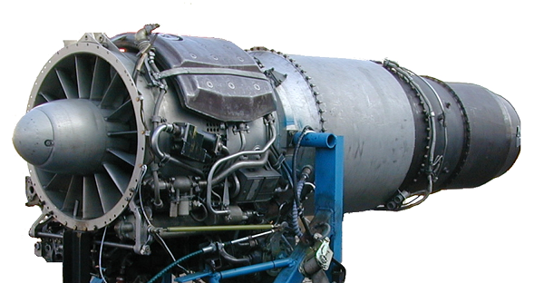
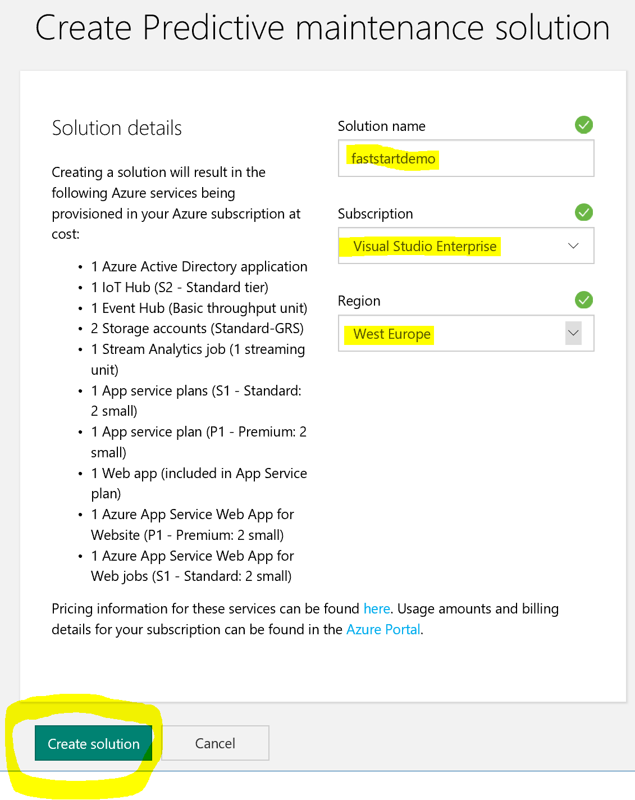

# Predictive Maintenance

Scenario
========

In this scenario, you will build a system which uses an external sensor to detect potential problems in a jet engine and relay the information to Azure.
The collected data will be used to proactively detect impending maintenance issues and send control signals back to the device.
This scenario will build on the Predictive Maintenance scenario which is part of the [Azure IoT Suite](http://wwww.azureiotsuite.com).

Credit for this project is as follows:-

* [Microsoft Premier Services](https://www.microsoft.com/en-us/microsoftservices/support.aspx).

Architecture
============

The IoT Suite predictive maintenance preconfigured solution is an end-to-end solution for a business scenario that predicts the point when failure is likely to occur.
You can use this preconfigured solution proactively for activities such as optimizing maintenance.
The solution combines key Azure IoT Suite services, including an Azure Machine Learning workspace.
This workspace contains machine learning experiments, based on a public sample data set, to predict the Remaining Useful Life (RUL) of an aircraft engine.
The solution fully implements the IoT business scenario as a starting point for you to plan and implement a solution that meets your own specific business requirements.

The system you are about to build consists of the following components and will work in the following manner:

1. The blue items are Azure services that are provisioned in the location you select when you provision the preconfigured solution. You can provision the preconfigured solution in either the East US, North Europe, or East Asia region.
2. Some resources are not available in the regions where you provision the preconfigured solution. The orange items in the diagram represent the Azure services provisioned in the closest available region (South Central US, Europe West, or SouthEast Asia) given the selected region.
3. The green item is a simulated device that represents an aircraft engine being monitored. It will constantly send out a stream of data. You will eventually replace this with a real device.
4. The gray items represent components that implement device administration capabilities. The current release of the predictive maintenance preconfigured solution does not provision these resources.

Basic Hardware Setup
====================

As described in the [Kit List for these scenarios](/Electronics/Kit%20List.md), you will need the following hardware items to build this scenario:

* [Microsoft IoT Pack for Raspberry Pi 3 - w/ Raspberry Pi 3](https://www.adafruit.com/products/2733)
* [1 x USB cable - A/MicroB - 3ft](https://www.adafruit.com/product/592)
* [1 x Adafruit Assembled Pi Cobbler Breakout + Cable for Raspberry Pi - Model B](https://www.adafruit.com/product/914)
* [Round Force-Sensitive Resistor (FSR)](https://www.adafruit.com/products/166)

Specifically the following items are required from the kit list:

* Raspberry Pi
* Breadboard (generic)
* MCP3008 - 8-Channel 10-Bit ADC With SPI Interface
* Resistor 10K ohm
* Resistor 220 ohm
* An LED
* Jumper Wires
* Force sensor

## Basic Circuit

Build your basic cicuit according to this diagram:

If you have more electronics experience, this is the circuit diagram of what you'll be building:

__TODO__

For interest/reference, these are the PINs on the Raspberry Pi.

These are the PINs on the MCP3008 Analog-to-Digital Converter.

## Circuit Output

The circuit has only a single sensor which is fed through an analog to digital converter with the output being a number between 0 and 1023.
This number is going to be fed into Azure IoT Suite.

## "Here's one I made earlier"

Azure Pre-reqs
==============

1. A working Azure subscription or trial - http://portal.azure.com
2. A working PowerBI subscription or trial - http://www.powerbi.com

Develoment Machine and IoT device Setup
========================================

1. Ensure your local development machine is setup according to these instructions: [Azure IoT Development machine setup](../IoT Developer Setup.docx?raw=true).
2. Part of the above document describes installing the "Device Explorer" tool - make sure that you *do* follow these instructions as you'll need that tool later on.
3. Ensure you have installed the [Connected Service for Azure IoT Hub Visual Studio Extension](https://marketplace.visualstudio.com/items?itemName=MicrosoftIoT.ConnectedServiceforAzureIoTHub)
4. Ensure you have [followed the instructions](https://developer.microsoft.com/en-us/windows/iot/docs/iotdashboard) to __Use the Windows 10 IoT Core Dashboard__ to setup your Raspberry Pi.

*Note about setting up Wi-Fi on the RPi:* IoT Dashboard shows all available networks that your PC has previously connected to. If you don’t see your desired Wi-Fi network on the list, ensure you’re connected to it on your PC. If you uncheck the Wi-Fi box when writing the Windows 10 IoT Core image onto your SD card, you must connect an Ethernet cable to your board after flashing. Whether using Wi-Fi or Ethernet, your device will recieve an IP via DHCP at start up.

For more in depth guidance on setting up your hardware device see [Get Started](https://developer.microsoft.com/en-us/windows/iot/GetStarted).

Step 1 - Setup Azure IoT Suite
==============================

[Azure IoT Suite](https://azure.microsoft.com/en-us/suites/iot-suite/) is a set of preconfigured components that every IoT project would benefit from when starting a new project. It contains an IoT Hub, Stream Analytics, PowerBI Dashboard plus a number of other components needed to kick start your project. It shows how these components are best connected together, what can be done with them and how by examining the template from which it is built you can create your own solutions.

There are two variations available for use:

* Predictive Maintenance
* Remote Monitoring

You can watch an introducatory video at https://docs.microsoft.com/en-us/azure/iot-suite/iot-suite-overview or read more about [Azure IoT Suite](https://docs.microsoft.com/en-us/azure/iot-suite/) 

For this scenario you are going to build a Predictive Maintenance Suite.

1. Start by opening https://www.azureiotsuite.com/ - you will need to login with your standard Azure Subscription credentials.
2. At the Azure IoT Suite page, __Click__ the large green + button.
    
3. Of the two solutions available, select "Predictive Maintenance".
    
4. Enter a name for the Solution, select your Subscription and choose a Region, then press __Create Solution__.
    
5. This will take about 20 minutes to complete.
    
6. When complete, __Click__ the __Launch__ button to open the portal for the new solution.
    
7.  You'll be asked to approve the application - say __yes__ to this.

Once this is complete you'll have a working demonstration the predictive maintenance application however you won't be able to modify or change it. Let's address that now.

Step 2 - Customization and deployment
=====================================

The solution you have just created is based off a template: https://github.com/Azure/azure-iot-predictive-maintenance which you are free to download, inspect, learn from and modify. Let's do that now.

1. Download or clone the entire GitHub repository to a local machine.
2. Open a Visual Studio developer command prompt and type:-
    `build.cmd cloud debug "mydeploymentname" "AzureCloud"`
    where "mydeploymentname" is a unique name for your installation.
3. As part of the running script you'll be asked for credentials for your Azure subscription, a subscription ID, which location you wish to install to and which Azure Active Directory to use. These will all be presented as menu choices - just enter appropriate values when requested. The values will be saved into a local configuration file.

This will create a new deployment in its own resource group what functions the same as the one you created in step 1. You may remove that now.

Step 3 - Examinine the what was created
=======================================

Once the deployment is complete (it may take up to 20 minutes), you can now take a look at the Azure Portal to see what was created:-

Notice the following key resources have been created as per the original architecture diagram above.

* An IoT Hub
* Event Hub
* Storage Account
* Database
* Website
* Stream Analytics Jobs.

What is missing from the list are the references to the Machine Learning components. You will understand where these are located shortly.

Step 4 - Open and View the Solution
====================================

A website has been created to run the basic application and dashboard. Assuming you created your deployment with the name `mydeploymentname`, the URL will be:-

`https://mydeploymentname.azurewebsites.net/`

